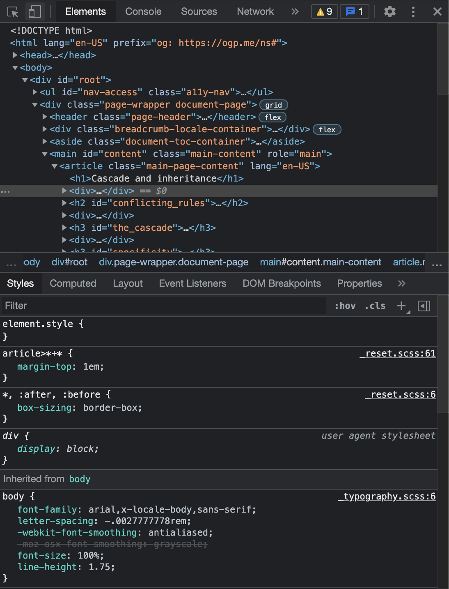

# Debugging

Een belangrijk onderdeel bij het schrijven van CSS is het kunnen debuggen van je CSS code. Je zal snel merken dat, wanneer je CSS schrijft, je regelmatig onverwachte fouten tegenkomt. Bij eenvoudige oefeningen kan je makkelijk je CSS file bekijken, aanpassingen maken en terug testen in de browser, maar al snel zal dit best een complexe en tijdrovende job worden.

Gelukkig bieden moderne browsers tegenwoordig zeer handige tools aan om ons als front end developers het leven makkelijker te maken. Die tools zijn gebundeld onder de 'developer tools'. In de meeste browsers zijn deze tools al standaard geactiveerd, en kan je eenvoudigweg in een pagina, op een element klikken met je rechtermuisknop. In het _context menu_ kan je dan kiezen voor _inspect_ \(inspecteren\). Er opent nu een extra venster in je browser waarbij je 2 of 3 actieve tools ziet: **Elements**, **Styles** en eventueel ook **Console**. Voor het schrijven van CSS zijn de eerste 2 tools \(Elements en Styles\) de belangrijkste. Die zien er ongeveer zo uit \(in Chrome op MacOS X\):

In de Elements tool zie je een interpretatie van de HTML pagina \(DOM\). Daarin kan je elementen selecteren, verder uitklappen en dieper liggende elementen \(children\) selecteren. Telkens je een element selecteert zal je in de Styles tool veranderingen zien. De Styles tool laat de actieve CSS regels op dat element zien, samen met de plaats \(file\) waar de regels zich bevinden.

In de styles tab kan je, naast het lezen van de actieve CSS regels, deze regels ook aanpassen, regels activeren/deactiveren, of regels bijvoegen/verwijderen. Zo kan je snel kleine fouten debuggen, of kleine dingen testen om ze daarna over te nemen in je echte CSS file.



